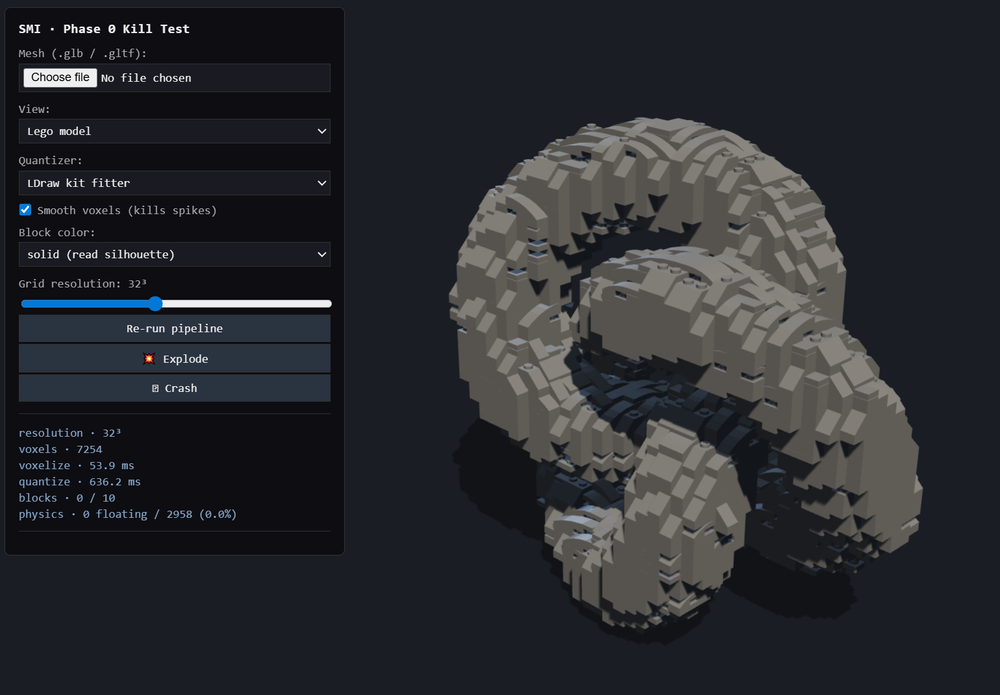

# Mesh2Bricks

Drop in a 3D mesh, get back a Lego model. Runs in the browser.



Voxelizes any `.glb` / `.gltf`, smooths the hull, then places real LDraw
parts (slopes, plates, bricks, domes, tiles, antennas, …) cell-by-cell
through a multi-pass greedy fitter. Renders with PCF soft shadows under
a studio light rig. Comes with a layer slider for build-step inspection
and Rapier-physics 💥 explode + 🪨 crash sims.

## Run

```
cd phase0
npm install
npm run dev
```

Opens at `http://localhost:5173`. A torus knot loads by default; drop in
your own mesh via the file picker.

## Repo layout

| Directory | What's in it |
|---|---|
| **[`phase0/`](phase0/)** | The viewer itself — Vite + TypeScript + Three.js + Rapier. See [`phase0/README.md`](phase0/README.md) for the full architecture writeup. |
| **[`ldraw_runner/`](ldraw_runner/)** | Node tool that fetches selected LDraw `.dat` files and pre-processes them into the JSON manifest the viewer loads at runtime. Manifest is already committed; only re-run if you want to add/remove parts. |
| `Spec.v2.md` / `Spec.v3.md` / `Spec.v3.1.md` | Design evolution from procedural generation through voxel-kit decomposition to the multi-pass LDraw fitter. Optional reading. |

## Parts library

50 LDraw parts bundled by default — bricks, plates, slopes (45°/33°/18°/curved),
round 1×1 and 2×2, 4×4 dome and dish, tiles (1×1…2×4 including grille and
round), the 4H antenna, the 2×6 double wedges, and a handful of decoration
pieces. Full list in [`phase0/README.md`](phase0/README.md#bundled-ldraw-parts-50).

LDraw geometry is licensed under [CCAL](https://www.ldraw.org/article/398.html);
the fitter is brick-agnostic and the manifest format is a plain JSON
schema, so swapping in a custom brick library is a data swap, not an
engine rewrite.

## Status

Working end-to-end. Known gaps:

- Multi-mesh GLBs use the first mesh only.
- Voxelizer flood-fills from outside the bbox; meshes with hairline holes
  leak and read as hollow.
- No stud-grid alignment pass between adjacent bricks yet.
- SNOT / clip pieces are loaded but not auto-placed.

See [`phase0/README.md` § Known limitations](phase0/README.md#known-limitations).
